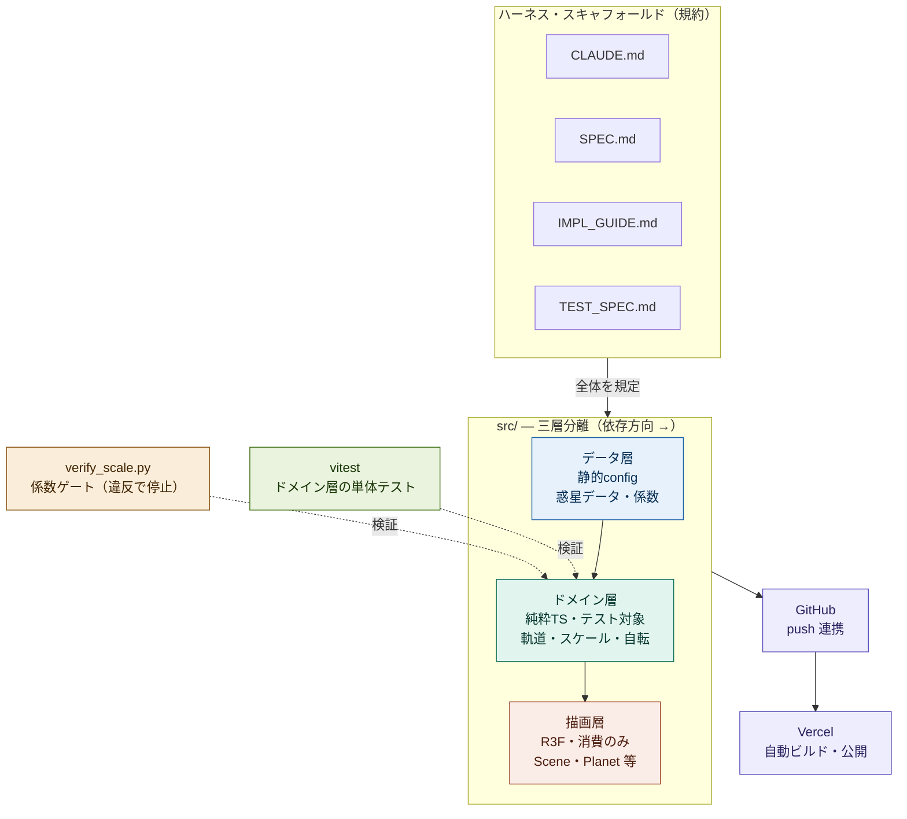

# アーキテクチャ

ハーネス・スキャフォールド（4ファイルの規約）が全体を規定し、`src/` を三層に分離する。
依存方向は一方向（データ層 → ドメイン層 → 描画層）で、描画層はドメイン層の計算結果を消費するだけ。
純粋TSのドメイン層のみが検証対象となり、GitHub 経由で Vercel に公開される。

## 読み方

- **規約（上段）**: 4ファイルのスキャフォールドが要件・実装指針・テスト観点を定め、実装全体を規定する。
- **三層分離（中段）**: 依存は左から右への一方向。描画層は座標計算を持たず、ドメイン層の純粋関数の結果を描くだけ。描画を差し替えてもロジックは無傷。
- **検証（点線）**: `vitest`（単体テスト）と `verify_scale.py`（係数ゲート）はいずれも Three.js 非依存のドメイン層を対象とし、高速に回せる。ゲートは不変条件違反で非ゼロ終了し、完了の定義に組み込まれる。
- **公開（下段）**: GitHub への push を Vercel が検知し、自動ビルド・公開する。

> 配色はライトテーマ向けに調整してある。GitHub のダークテーマで見づらい場合は末尾の `classDef` 群を削除すると、テーマ標準色でレンダリングされる。
